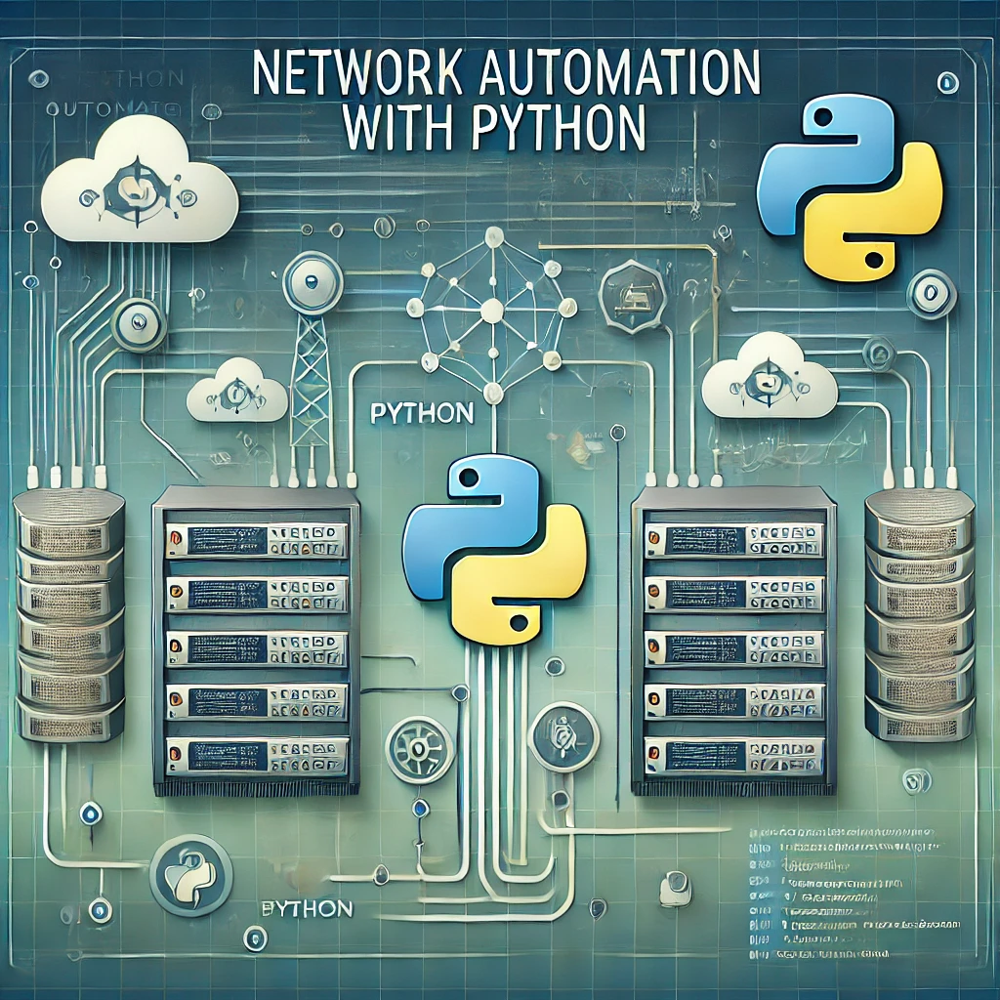

# Network Automation with Python

Welcome to the "Network Automation with Python" course! This course is designed to equip you with the essential skills to automate and manage network configurations using Python. Whether you're a network engineer looking to streamline your operations, or a developer eager to dive into network automation, this course has something for you.

### Course Overview

In this course, you'll learn:

- **Python Basics for Networking**: Get a solid understanding of Python programming tailored for networking tasks.
- **Automation Techniques**: Learn how to automate repetitive network tasks, reduce human error, and improve efficiency.
- **Working with Network Devices**: Gain hands-on experience in interacting with network devices using Python libraries such as `Netmiko`, `Paramiko`, and `NAPALM`.
- **Building Network Scripts**: Develop scripts that can automate device configuration, monitoring, and troubleshooting.
- **Real-world Scenarios**: Apply your skills in real-world scenarios with labs and projects that mimic actual network environments.

### Why Learn Network Automation?

As networks grow more complex, manual configuration and management become increasingly challenging. Automation is the key to maintaining agility and ensuring that your network remains secure and up-to-date. Python, with its simplicity and vast ecosystem of libraries, is the ideal language to help you achieve this.

### Who Should Enroll?

This course is perfect for:

- Network Engineers and Administrators looking to automate their daily tasks.
- Developers interested in expanding their skill set into networking.
- IT professionals aiming to increase their productivity and efficiency.

### Prerequisites

Basic understanding of networking concepts and Python programming is recommended, but not required.

---

Let's automate your network together!

---

For more information on the course content, please refer to the [course outline](./course-outline.md).